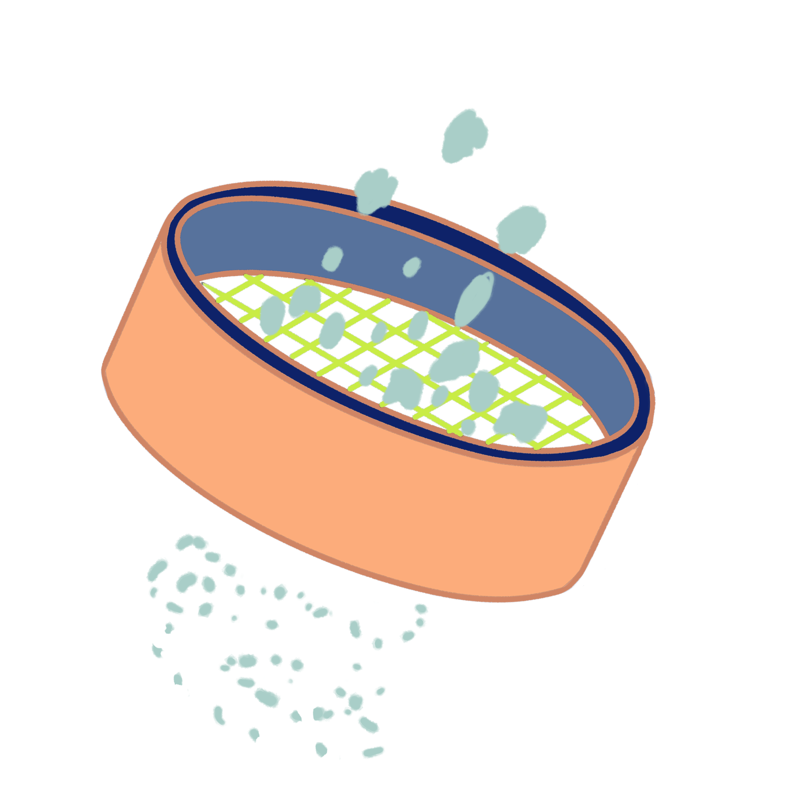

<h1 style="display: flex; align-items: center; justify-content: center;">
  
  <span>Sift</span>
</h1>

https://github.com/user-attachments/assets/8ea10a8c-c268-4f01-bf11-9867c7d040ec


Simple Search Engine

## But Why?

I wanted to create a project that was technically advanced compared to my other projects and one that can challenge my CS knowledge. Also I got a little bit bored of writing CRUD applications so why not switch it up.

## Features

- Concurrent web crawler with hostname-based rate limiting
- Configurable crawl limits, worker counts, pending URLs, and host queues
- URL and HTML deduplication using canonical URLs, SimHash, and union-find clustering
- Inverted index with title, body, domain, and URL-path token metadata
- BM25 search ranking with title, domain, and URL relevance boosts
- Query normalization, stemming, original-token tracking, concatenated URL matching, and token coverage scoring
- Persistent binary index files with memory-mapped posting reads
- SQLite storage for crawled pages and index metadata
- Web interface for searching and viewing query and index metrics

## How to Run

### Clone the repository

Clone the repository and enter the project directory:

```sh
git clone https://github.com/twitocode/Sift.git
cd Sift
```

### Requirements

- Go
- Node.js

### Configuration

The server loads variables from `server/.env`. Start by copying the example:

```sh
cd server
cp .env.example .env
```

Set `DATABASE_URL`, `FRONTEND_APP_URL`, and the other application secrets in `server/.env`. My development configuration used:

| Setting | Value |
| --- | ---: |
| `APP_ENV` | `development` |
| `PORT` | `8000` |
| `SQLITE_DB_NAME` | `sift` |
| `CRAWL_COUNT` | `500000` |
| `SPIDER_COUNT` | `256` |
| `MAX_URLS_PER_HOST` | `300` |
| `MAX_HOST_QUEUES` | `100000` |
| `MAX_PENDING_URLS` | `200000` |
| `JOB_DISPATCH_DELAY` | `100` |
| `SHOW_CRAWL_STATS` | `true` |
| `SHOW_INDEXING_STATS` | `true` |

This was tested on a Macbook Air M4 16GB RAM 256GB SSD

Read more in `server/.env.example`

### Set up SQLite

Sift uses SQLite for crawled pages, links, document metadata, and index metadata. The database files live in `server/db/sqlite`.

Create the directory, configure the database name in `server/.env`, and create the database file yourself:

```sh
cd server
mkdir -p db/sqlite
touch db/sqlite/sift.db
```

`SQLITE_DB_NAME` is used by the application as the database filename. For example:

```env
SQLITE_DB_NAME=sift
```

The database file is:

```text
server/db/sqlite/sift.db
```

The migration settings must point to the same database:

```env
GOOSE_DRIVER=sqlite3
GOOSE_DBSTRING=./db/sqlite/sift.db
GOOSE_MIGRATION_DIR=./db/sqlite/migrations
GOOSE_TABLE=goose_migrations
```

Install the Goose CLI if it is not already available, then run all SQLite migrations from the `server` directory:

```sh
go install github.com/pressly/goose/v3/cmd/goose@latest
goose up
```

The application does not create the SQLite database for you. If you change `SQLITE_DB_NAME`, create the corresponding `.db` file and update `GOOSE_DBSTRING` to match it before running `goose up`.

### Storage and memory

The data I used in development used these resources:

| Resource | Usage |
| --- | ---: |
| 500k pages SQLite database (`server/db/sqlite/sift_500k_pages.db`) | 4.4 GB |
| 10k pages version (`server/db/sqlite/sift_10k_pages.db`) | 180 MB |
| Search index postings (`server/index_data/postings.dat`) | 3.0 GB |
| Search index terms (`server/index_data/terms.dat`) | 199 MB |
| RAM during crawling/indexing (500k pages) | **2 GB** |
| RAM during search/API use (500k pages) | **7 GB** |

Storage usage will vary with crawl count and index contents. The SQLite database and generated index files are created relative to the `server` directory.

Crawling takes about 30 minutes with 500k pages and 1 minute with 10k pages.
Indexing takes about 3 minutes with 500k pages

### Run the crawler and indexer

Run the combined crawler and indexer from the `server` directory:

```sh
cd server
go run ./cmd/sift
```

This runs the crawl and indexing pipeline, then executes the sample ranker queries. It does not start the HTTP API.

If you want the api (also runs indexing if needed and ranking) then run:
```sh
go run ./cmd/api
```


To run the stages separately:

```sh
go run ./cmd/crawl
go run ./cmd/index
go run ./cmd/rank
go run ./cmd/api
```


The API starts on `http://localhost:8000` and requires the PostgreSQL connection configured by `DATABASE_URL`. The crawler, indexer, and ranker use the SQLite database configured by `SQLITE_DB_NAME`.

### Run the client

In a second terminal:

Set `VITE_SERVER_URL` in `client/.env` to the API URL if it is not `http://localhost:8000`. The client runs on `http://localhost:3000`.

```sh
cd client
cp .env.example .env
npm install
npm run dev
```


## Challenges

### July 16–17, 2026 — Initial crawler and rate limiting

#### Crawling

The original crawler started with seed URLs. The queue spawned spiders, each spider fetched a page, extracted its hyperlinks, and added those links back to the queue. I also kept a counter for the number of passes through the queue.

The first challenge was avoiding rate limits. I created a pending pool of crawling jobs that waited for a hostname-specific channel before being executed. Memory usage began to explode, so I eventually moved toward a domain-filtering system.

### July 17–22, 2026 — Frontier concurrency and memory

The crawler frontier became a large, difficult-to-manage file, and concurrency errors started appearing. I was creating goroutines where they were not needed and did not have proper cancellation procedures during shutdown, which led to channel-send errors.

I added a Bloom filter to track duplicate entries. This was also my first time using bitwise operations. The original Bloom filter used an array of bytes sized according to the number of expected crawled URLs, but it used too much memory. I replaced it with a bit set: an array of bytes where each individual bit represents an index. Bits 0–7 represent the first byte, bits 8–15 represent the second byte, and so on.

By July 22, 2026, the program could crawl 10,000 pages with 150 spiders.

### July 22–28, 2026 — JavaScript pages and content deduplication

A major limitation was that the crawler could not handle JavaScript-heavy websites.

I decided to implement SimHash from scratch for HTML deduplication. Bitwise operations were difficult to understand at first, as were little-endian and big-endian representations. I also had to figure out how to quickly check whether a document was a duplicate among thousands of documents. I split fingerprints into chunks of bits and checked them against a lookup table.

I originally planned to perform HTML deduplication during crawling, but that caused problems, so I moved it to an asynchronous step.

For content deduplication, I first looked for combinations of pages with identical canonical content. For pages that were not identical, I used SimHash to find similar pages and cluster them together. The algorithm then chooses a canonical page based on several factors. I learned how to use the union-find algorithm to cluster similar pages.

### July 28–August 8, 2026 — Indexing and crawler performance

I implemented an inverted index that maps tokens to postings containing the document ID, title-token information, and token frequency. I also learned about atomic primitives in Go.

I made several performance improvements. The main bottlenecks were having large `MaxIdleConnsPerHost` and `MaxIdleConns` values, as well as reading an entire HTML document just to determine its size. Using the response's `ContentLength` reduced unnecessary work, and heap allocations went down by 100 times.

For approximately 20,000 pages, memory usage fell from 2 GB to about 150 MB.

### August 8–15, 2026 — Frontier redesign and crawler failures

I had several serious bugs. One caused the indexing stage to receive fewer pages than were stored in the database. The root cause was a race condition in the crawl frontier: multiple goroutines could check whether the same URL had been dispatched immediately before one of them inserted it into the database. Another spider could then refetch and insert the same URL. At the time, `INSERT OR REPLACE` hid the duplicate by overwriting it while making the crawler appear to have stored a new page.

Another flaw was that the crawler ran quickly when its buffer queues contained infrequent hosts, but slowed down when many URLs belonged to hosts with frequent cooldowns.

I rewrote most of the frontier. The old system used a thread-safe map as a buffer of hosts and their URLs. Hosts with many URLs could clog the map, which was limited to save memory. The new system uses:

- A global hosts map
- A ready-host queue for hosts that can be fetched
- A cooldown-host min-heap for hosts that are waiting to become available

When a link is discovered, an available host enters the ready queue and is sent to a spider through a Go channel. After fetching, the host enters cooldown using its timeout and delay functions. The engine watches the root of the cooldown heap and moves hosts back to the ready queue when they become available.

This reduced a 20,000-URL crawl from about seven minutes to five minutes. Metrics showed that DNS and request timeouts were the next major bottleneck: the median request duration was about 750 ms, the maximum was 10 seconds, and both the IQR and Q3 were about 5 seconds.

I added a negative cache for DNS failures so URLs from the same failing host would not repeatedly perform the same lookup. This reduced runtime from about five minutes to two minutes. I also noticed that the crawl started slowly but became considerably faster as more URLs were discovered.

### August 15–18, 2026 — Search and large-scale indexing

For the third stage of the search engine, I used the inverted index to process user queries. Results are ranked using BM25, based on factors such as the frequency of a token inside a document.

I wanted to scale the crawler from 20,000 pages to 200,000 pages, but the indexer was too slow and used 7 GB of memory. I reduced memory usage by experimenting with struct padding and smaller data types where possible.

The indexer previously fetched every page from the database at once. It now first counts the pages, divides them into batches, splits each batch among parallel workers, and fetches the next batch after the workers finish.

### August 18–30, 2026 — Persistent index storage and ranking bugs

To make ranking faster, I added a heap that keeps the pages with the highest BM25 scores before their full records are fetched from the database. The root of the heap is the lowest score, making new candidates fast to insert.

The indexer previously regenerated the entire index every time, which could take up to three minutes for 500,000 pages. I changed it to dump term metadata into `terms.dat` and postings into `postings.dat`. Each `terms.dat` entry stores a term, its byte offset in `postings.dat`, and its posting count. The postings file uses binary little-endian numbers, which is faster to read than converting string numbers.

The postings file was still approximately 1 GB for 500,000 pages, and loading the entire file into memory was a problem. I introduced memory-mapped reads so the ranker reads only the relevant section of the file.

Some websites place their `<title>` tag inside `<body>` instead of `<head>`, which exposed a title-extraction bug.

I also found a serious indexing and ranking bug: a SQL function was not returning a page's final URL. As a result, domain token frequency was always zero, so queries such as `github.com` could not rank GitHub URLs correctly.

### August 30–31, 2026 — Improving query accuracy

The biggest ranking improvements came from a new tokenizer and token-coverage calculation.

Previously, I split a query into tokens and stemmed and normalized them. This caused accuracy problems because I did not keep track of the user's original query. For example, `anne hathaway archive` became `[ann, hathaway, archiv]`, allowing unrelated pages to overpower pages that actually matched the query.

The new system keeps original tokens and lookup tokens separate. For `anne hathaway archive`, the original tokens are `[anne, hathaway, archive]`. Lookup tokens also include stems and possible URL forms such as `annehathaway`, `anne-hathaway`, `hathawayarchive`, `hathaway-archive`, `annehathawayarchive`, and `anne-hathaway-archive`. This allows the ranker to find websites whose domains combine query words.

Domain boosts now use the BM25 IDF value: tokens that appear on many pages, such as `archiv`, receive a smaller boost than rare tokens such as `hathaway`. URL boosts use the same idea with a lower multiplier.

The ranker also adds an exact-match or substring bonus to account for incomplete spelling.

The coverage system tracks how many query words each page satisfies. A page containing `anne` ten times ranks below a page containing `anne`, `hathaway`, and `archive` once each. A token covers an original word if it equals the word, is a stem of it, or is a concatenation of it.

After all tokens are processed, the score is multiplied by `(matched / total)^2`. This penalizes pages that match only a small part of the query.
